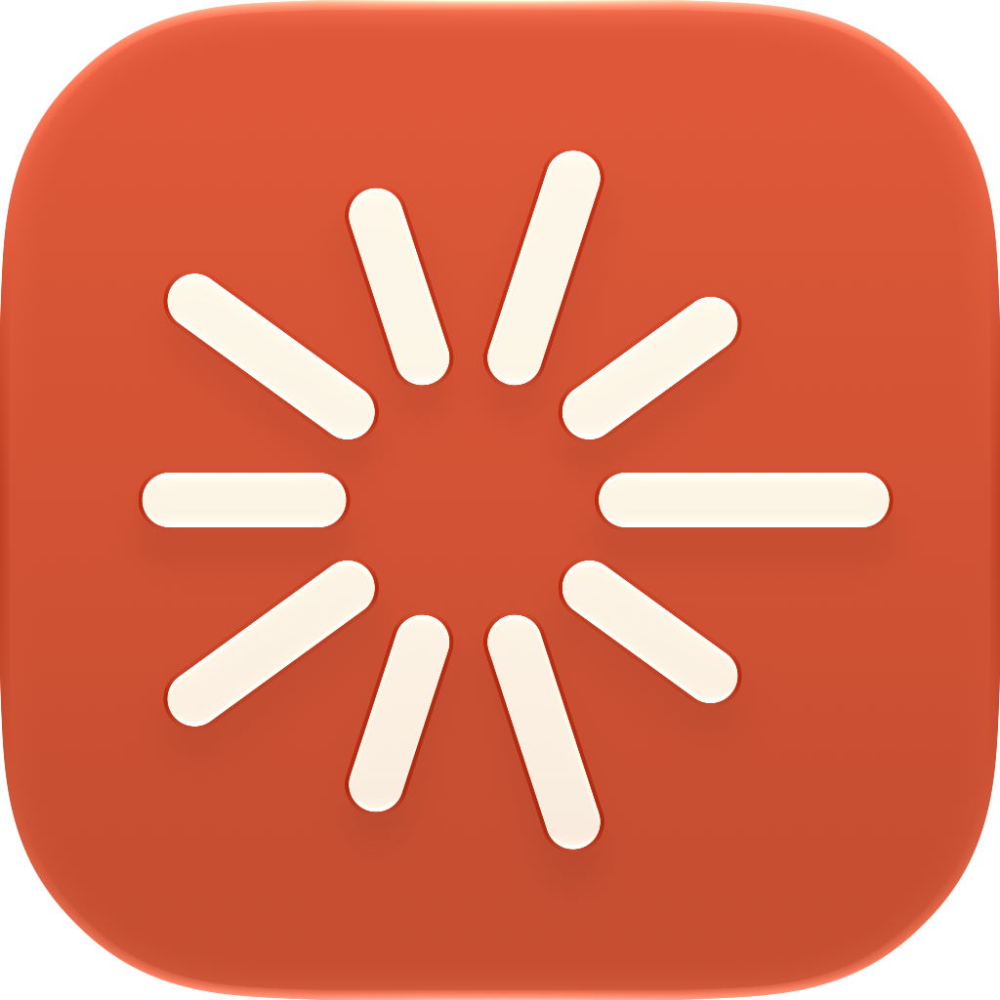
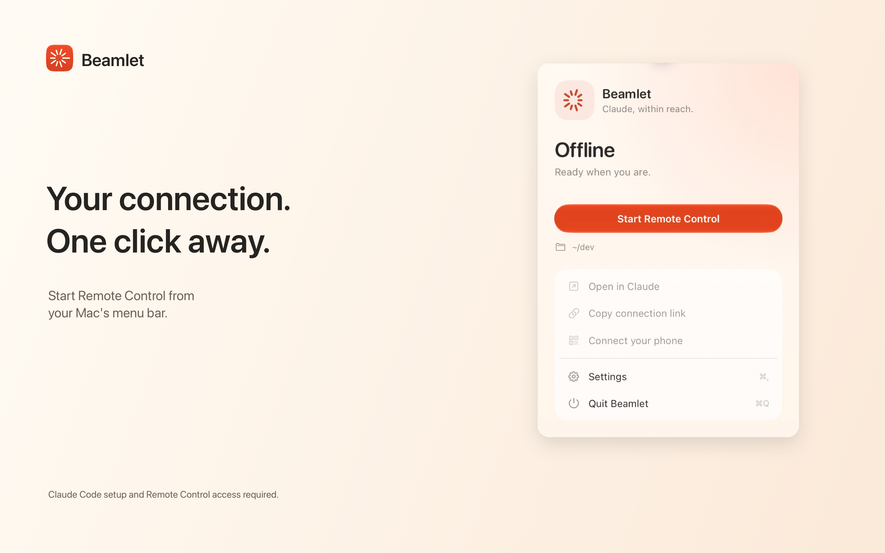

<p align="center"></p>
<h1 align="center">Beamlet</h1>
<p align="center"><strong>Claude, within reach.</strong><br>Remote Control in your Mac’s menu bar. Ready when you are.</p>

<p align="center">
  <a href="https://github.com/BlockchainHB/Beamlet/releases/tag/v0.1.0">Download for Mac</a> ·
  <a href="#get-started">Get started</a> ·
  <a href="https://blockchainhb.github.io/Beamlet/">Website</a> ·
  <a href="https://github.com/BlockchainHB/Beamlet/issues">Feedback</a>
</p>
<p align="center"><strong>Native SwiftUI</strong> &nbsp; / &nbsp; <strong>macOS 14+</strong> &nbsp; / &nbsp; <strong>Free & open source</strong></p>



You shouldn’t need a dedicated terminal window just to keep Remote Control running.

Beamlet gives `claude remote-control` a small, native home: start it, see its status, open your session, and stop it when you’re done. Pick up the conversation in Claude on your phone or in a browser while the work runs on your Mac.

## Small app. All the right controls.

| | What you get |
| --- | --- |
| **One-click connection** | Start and stop Remote Control from the menu bar. |
| **Status at a glance** | See starting, online, reconnecting, offline, and attention states. |
| **An easy handoff** | Open in Claude, copy the session link, or show a QR code for your phone. |
| **Your workspace** | Choose the folder where Claude starts and the CLI installation Beamlet uses. |
| **Your routine** | Optional launch at login, automatic connection, and attention notifications. |
| **Thoughtful recovery** | Limited retry attempts after unexpected exits. Pressing Stop keeps it stopped. |
| **Stay available** | Optionally keep your Mac awake while connected to power and running Remote Control. |

## Get started

**[Download Beamlet 0.1.0 — Public Beta](https://github.com/BlockchainHB/Beamlet/releases/tag/v0.1.0).** Unzip the download, drag Beamlet to Applications, and open it. The universal app is Developer ID signed and notarized by Apple. See the release notes for beta testing coverage; there is no Mac App Store version.

### 1. Set up Claude Code once

You need macOS 14 or later, [Claude Code](https://code.claude.com/docs/en/setup), and an account with [Remote Control access](https://code.claude.com/docs/en/remote-control). Beamlet is free; Anthropic’s account requirements still apply.

In Terminal, go to the folder you want to use and run `claude`. Sign in with `/login` if needed, accept workspace trust, then exit Claude. Run:

```sh
claude remote-control
```

Accept its one-time Remote Control consent. Once it connects successfully, press **Control-C** to stop that terminal session.

### 2. Choose your workspace

Open Beamlet → **Settings → Connection** and choose that same starting folder. Beamlet detects common Claude installations; you can choose an executable manually if yours is elsewhere.

Use a project folder or a dedicated development folder—not your home directory. Claude’s workspace trust and permissions still apply.

### 3. Start. Connect. Carry on.

Click **Start Remote Control**. Once Online, choose **Open in Claude**, **Copy connection link**, or **Connect your phone**.

After setup, Beamlet manages the process without a dedicated terminal window. Keep your Mac powered on and connected to the internet.

## A companion to your existing setup

```text
Beamlet on your Mac → your installed Claude Code → Claude on your phone / browser
```

Beamlet manages the process it starts. Claude handles authentication, permissions, project access, and the conversation. There is no separate Beamlet account, AI subscription, or cloud backend.

Closing Settings leaves Beamlet running in the menu bar. **Stop** ends its managed connection. **Quit Beamlet** requests shutdown of the process it owns. It does not intentionally stop unrelated sessions you started in Terminal.

## A few useful answers

<details>
<summary><strong>Does my Mac need to stay awake?</strong></summary>

Yes. This is a connection to work running on your Mac. The optional keep-awake setting applies while Remote Control runs and your Mac is plugged in. The display can sleep; closing the lid can still put the Mac to sleep.

</details>

<details>
<summary><strong>I’m signed in, but Beamlet asks me to sign in again.</strong></summary>

Check the installation and account in Terminal:

```sh
command -v claude
claude auth status --json
```

Select that executable in **Settings → Connection**. If it reports that you are signed out, run `claude auth login`. Being signed into the Claude desktop app does not necessarily mean the CLI is signed in.

</details>

<details>
<summary><strong>Why is it stuck on Starting?</strong></summary>

Run `claude remote-control` manually in the same folder to complete any sign-in, workspace trust, or consent prompts. Stop it before starting Beamlet. Account eligibility, organization policy, CLI changes, and network problems can also prevent startup. See [setup and support](https://blockchainhb.github.io/Beamlet/support/).

</details>

<details>
<summary><strong>What happens to my data?</strong></summary>

Beamlet stores preferences locally and keeps bounded connection diagnostics in memory. It has no added analytics or automatic diagnostic uploads. Claude Code connects to Anthropic under its own policies; this is not a claim that Claude activity stays entirely on your Mac. Keep session links and QR codes private. [Read the privacy policy](https://blockchainhb.github.io/Beamlet/privacy/).

</details>

<details>
<summary><strong>Why GitHub instead of the Mac App Store?</strong></summary>

Beamlet launches your existing Claude Code installation. The App Store’s sandbox restrictions block that external-executable design. Direct distribution preserves the workflow. The experimental store target is retained for research and is not a working distribution option. [Technical findings](docs/APP-STORE-BUILD.md).

</details>

## Build it yourself

Use Xcode with Icon Composer support (Xcode 26 or later) and [XcodeGen](https://github.com/yonaskolb/XcodeGen). Development here uses Xcode 27. Older supported macOS versions and Intel hardware still need release QA; a universal build alone does not establish that coverage.

```sh
git clone https://github.com/BlockchainHB/Beamlet.git
cd Beamlet
bash scripts/build-local.sh
```

Open `build/Beamlet.app`. This command creates an **ad-hoc-signed local development build**, not the signed release artifact.

For the Xcode project, run `xcodegen generate`, open `Beamlet.xcodeproj`, and select the **Beamlet** scheme.

```sh
swift test --build-system native --sdk "$(xcrun --sdk macosx --show-sdk-path)"
python3 Tests/Runner/test_runner.py .build/debug/BeamletRunner
```

The app uses SwiftUI and AppKit, a testable Swift connection-state core, and a small C process runner. See [architecture decisions](docs/DECISIONS.md) and the [direct-release guide](docs/DIRECT-RELEASE.md).

## Make it better

Found a rough edge? [Open an issue](https://github.com/BlockchainHB/Beamlet/issues) with your macOS, Beamlet, and Claude Code versions plus steps to reproduce. Review diagnostics before sharing; never post credentials, private code, session URLs, or QR codes.

Small, focused pull requests are welcome. For changes to process ownership, recovery, or connection parsing, include a test that demonstrates the behavior. Keep the app native, quiet, and easy to understand.

---

Built by [Hasaam](https://github.com/BlockchainHB). Free under the [MIT License](LICENSE). Dependencies retain their own licenses.

[Support](https://blockchainhb.github.io/Beamlet/support/) · [Privacy](https://blockchainhb.github.io/Beamlet/privacy/) · [Terms](https://blockchainhb.github.io/Beamlet/terms/)

Independent community utility. Not affiliated with or endorsed by Anthropic. Claude and Claude Code identify compatibility; no Claude subscription is included.
